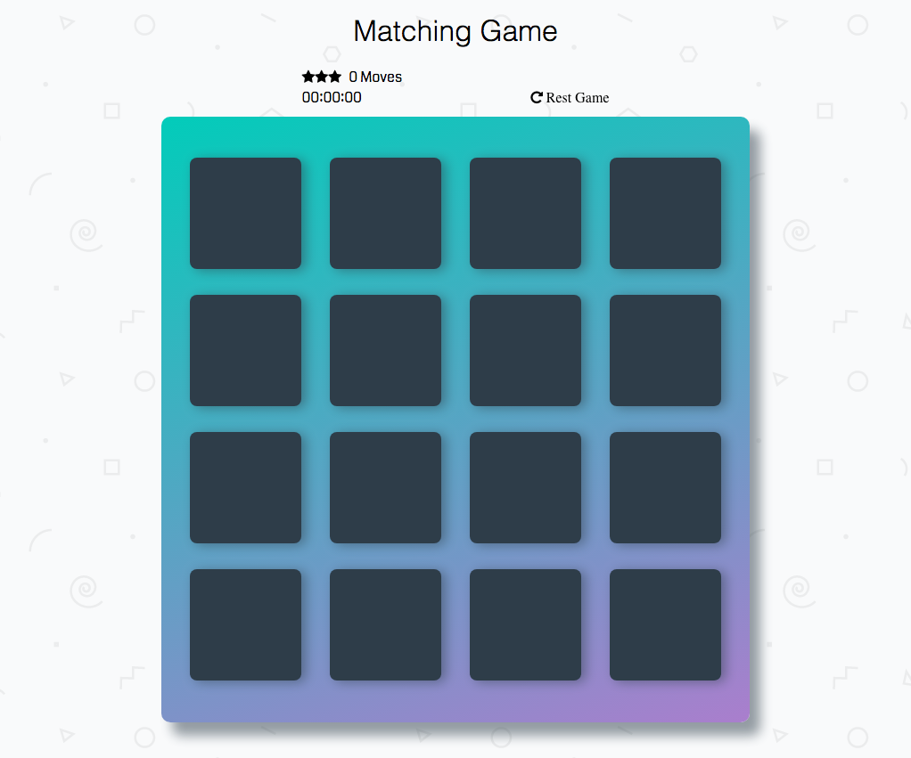

## The aim of the game is to find matching pairs.

### The project details 
The task set out by Udacity was to start with a minimum base code, from that our task was to create a fully working memory game, with flipping fx,

to complete this task i have used.... 
easytimer library - https://albert-gonzalez.github.io/easytimer.js/
animateCss https://daneden.github.io/animate.css/
I also had some help from my Mentor and others in the FEND Community.

* I have split my code into functions, this has allowed me to work on one function at a time, so that I may test a given funtion before moving on to the next.

* I am able to pull any of my function into another, this allows a lot of flexability.

### Things i would like to add or change

1. Add a Best score system
2. change the symbles into yugioh cards with my sons help (family time :)
3. add sound to the game
4. add text overlay when a mack is found

